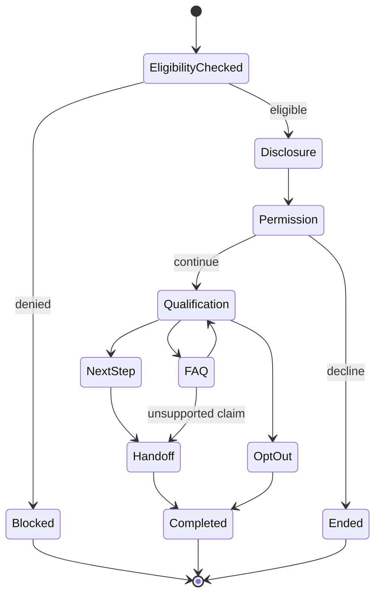
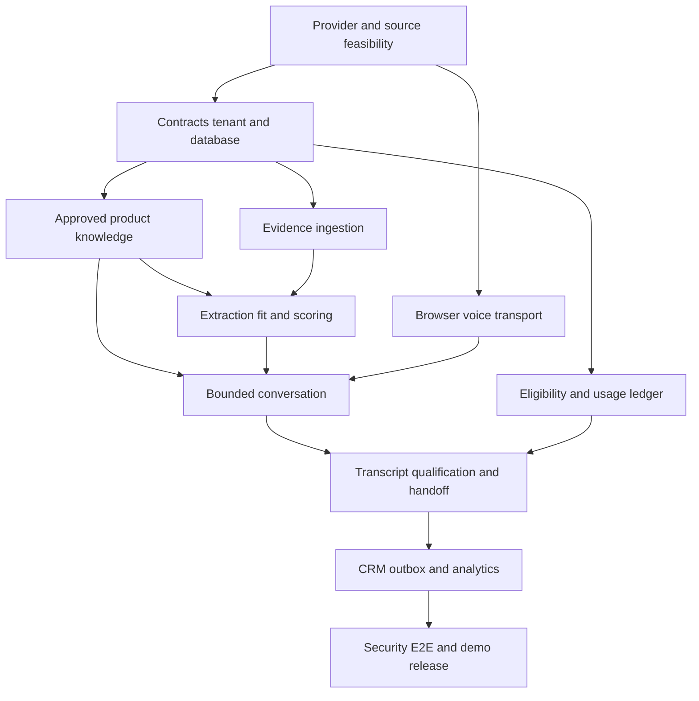

# Codex Four Day AI Sales Agent MVP Implementation Plan

## 1 Mission and finish line

Codex must build one coherent, demonstrable MVP in four days:

> Approved company offering → permitted requirement evidence → normalized opportunity → attributed enrichment → explainable fit score → approved pre-call brief → controlled English/Hindi browser voice qualification → transcript and structured outcome → human handoff → HubSpot test update → visible analytics.

This is not a mandate to implement the entire PRD. The goal is a reliable, portfolio-grade vertical slice that proves the differentiated workflow. Every screen and service must support that story.

### Non-negotiable demo acceptance criteria

1. A user can sign in and enter one organization workspace.
2. The workspace has one approved offering, ICP and versioned knowledge set.
3. The system ingests at least one permitted source URL or bundled fixture.
4. The lead record displays the original URL, publication date when known, evidence excerpt and field-level provenance.
5. Unknown values remain unknown. The system never fabricates budget, contact authority, phone number or urgency.
6. A deterministic score displays its component contributions and uncertainty.
7. An operator must approve the lead and pass an eligibility check before starting a call.
8. A consenting test participant can complete a browser-based English/Hindi voice conversation.
9. The participant can interrupt the agent and stop its current response.
10. Product answers are grounded in the approved catalog. Unsupported pricing or commitments trigger a human handoff.
11. The call produces transcript segments, structured qualification, outcome and next-best action.
12. A human follow-up task is created and one HubSpot sandbox/test record is updated through an idempotent outbox job.
13. The UI exposes pending, succeeded, retrying and action-required integration states.
14. A compact analytics screen shows discovered, reviewed, approved, called, qualified and handed-off counts plus measured usage.
15. The complete 3–5 minute demo succeeds three consecutive times from a clean reset.

### Product boundaries

Build only one organization, one workspace, one service-company offering, one approved discovery path, English/Hindi, one consenting call flow and one CRM adapter. Do not build native mobile apps, unrestricted scraping, LinkedIn/Upwork automation, autonomous mass calling, email sending, multi-agent orchestration, Kubernetes, custom foundation models, multi-region infrastructure, full subscriptions, all languages, every CRM or predictive revenue forecasts.

Public evidence is not permission to call. The demo may call only a consenting team/test participant. Exotel is conditional; browser audio is the required working transport.

## 2 Codex operating contract

Codex should follow these rules throughout all four days.

### 2.1 Work style

- Work in thin vertical slices. A task is not complete until the API, persistence, UI state and relevant test agree.
- Keep one integrated main branch or short-lived branches lasting less than half a day.
- Inspect the existing repository and `AGENTS.md` before changing anything.
- Maintain a live plan with exactly one task marked in progress.
- Before each task, identify the files, contract, dependency and test that will change.
- After each task, run the narrow tests first and then the affected integration suite.
- Commit only working checkpoints. Use descriptive conventional commits.
- Preserve user changes and never use destructive Git commands.
- Do not silently replace a selected provider or architecture. Record a short ADR when a boundary changes.
- Do not claim a live source, live phone call, CRM write or booking unless the external result is verified.

### 2.2 Engineering invariants

- PostgreSQL is authoritative for business state, evidence, policy decisions, outbox events and usage.
- Every tenant-owned table includes `tenant_id` and every API operation derives tenant context from the authenticated membership, never from an untrusted client field.
- Every externally observed fact can point to a source assertion containing source URL, evidence span, observation time, extraction method, confidence and status.
- Every model call uses a versioned prompt/schema and stores provider, model, latency, token usage and result status.
- Every external side effect has an idempotency key and visible lifecycle.
- Every call requires an eligibility decision, consent/test-purpose record, spend reservation, maximum duration and kill switch.
- External documents and web pages are untrusted data. Their text cannot issue instructions or authorize tools.
- The voice model cannot write arbitrary SQL, browse freely, change pricing, send messages or promise a human is available.
- Tool calls are typed requests checked again by the server outside the model.
- Logs never contain raw secrets, full phone numbers, access tokens or unrestricted transcript content.

### 2.3 Stop conditions

Codex must stop adding scope and protect the working demo when any condition occurs:

- Voice round-trip is not stable by the end of Day 3 Block 2: lock browser voice, remove PSTN work.
- A permitted live source is unavailable by Day 2 Block 1: use the bundled, clearly labeled permitted fixture.
- HubSpot credentials are unavailable by Day 3 Block 4: use a deterministic mock adapter in the UI, label it simulated, and retain the real adapter contract.
- A model fails structured extraction repeatedly: fall back to the deterministic fixture output and expose the failure state.
- Feature-freeze begins on Day 4. No new subsystem or provider is allowed after that point.
- Any cross-tenant access, unauthorized tool use, duplicate call or fabricated product claim blocks release.

## 3 Fixed implementation stack

| Layer | Four-day choice | Rule |
|---|---|---|
| Repository | pnpm + Python workspace monorepo | One repository and shared contracts |
| Web | Next.js, TypeScript, Tailwind, shadcn/ui | Responsive desktop-first product UI |
| Web data | TanStack Query, React Hook Form, Zod | Server state separate from local UI state |
| API | Python, FastAPI, Pydantic, SQLAlchemy, Alembic | Modular monolith with typed boundaries |
| Identity | Supabase Auth or development JWT adapter | Membership authorization remains application-owned |
| Database | PostgreSQL, JSONB, full-text search | No separate search/vector database for MVP |
| Async work | Celery, RabbitMQ, transactional outbox | Inline development mode allowed behind an adapter |
| Extraction | Trafilatura plus bounded parser | Store raw snapshot metadata and extracted evidence |
| Discovery | One approved source plus manual URL/fixture | Tavily only if account and source terms are ready |
| Offline model | Gemini Flash-Lite adapter | Structured extraction and summaries |
| Dialogue model | Claude Haiku adapter | Replaceable, bounded conversation model |
| Voice | Pipecat, Sarvam streaming STT and Bulbul TTS | Browser WebRTC/WebSocket transport mandatory |
| Telephony | Exotel adapter | Optional and feature-flagged |
| CRM | HubSpot test adapter | One direction: create/update lead note and task |
| Storage | S3-compatible or Supabase Storage | Documents only; audio recording off by default |
| Telemetry | OpenTelemetry-compatible structured instrumentation | Small visible metrics view for demo |
| Deployment | Docker Compose locally; warm container deployment | Deploy by Day 1, not at the end |
| Tests | pytest, Playwright, Vitest, Ruff, mypy, ESLint | Release gates, not ceremonial configuration |

Provider integrations must sit behind local protocols so development can run with deterministic fakes.

## 4 Target repository structure

```text
/
├── AGENTS.md
├── README.md
├── Makefile
├── compose.yaml
├── .env.example
├── apps/
│   ├── web/
│   ├── api/
│   ├── worker/
│   └── voice/
├── packages/
│   ├── domain/
│   ├── ai/
│   ├── connectors/
│   └── contracts/
├── database/
│   ├── migrations/
│   ├── policies/
│   └── seeds/
├── tests/
│   ├── contract/
│   ├── integration/
│   ├── e2e/
│   ├── security/
│   ├── voice/
│   └── fixtures/
├── infrastructure/
│   └── containers/
├── scripts/
└── docs/
    ├── adr/
    ├── architecture/
    ├── demo/
    └── runbooks/
```

Keep `packages/domain` independent from FastAPI, Celery, model SDKs and provider SDKs. Framework entrypoints translate external requests into domain commands.

## 5 Core contracts to freeze first

### 5.1 Minimum database tables

Create only the fields needed for the vertical slice, but retain correct ownership and history.

| Table | Required purpose and critical fields |
|---|---|
| organizations | `id`, `name`, timestamps |
| workspaces | `id`, `tenant_id`, `name`, locale, timezone |
| memberships | `tenant_id`, `user_id`, role, status; unique membership |
| products | offering identity and active version |
| product_versions | approved description, ICP, exclusions, facts, pricing policy, approval time |
| source_documents | canonical URL, source type, rights note, fetched/published time, content hash, extraction status |
| requirements | source document, normalized need, category, geography, urgency, evidence span |
| companies | normalized name/domain/location and merge status |
| contacts | optional test/authorized contact, verification and eligibility data |
| leads | tenant-specific requirement/company/product relationship and lifecycle |
| field_assertions | entity, field, value JSON, source, evidence span, confidence, observed time, status |
| score_snapshots | feature values, weights, total, explanation, model/rule version |
| campaigns | one demo campaign, timezone, budget and status |
| campaign_leads | approval and ownership state |
| consent_records | channel, purpose, scope, source, status and timestamp |
| suppressions | channel/identifier hash, reason, scope and expiry |
| calls | attempt ID, transport, state, eligibility decision, started/ended time, usage and outcome |
| transcript_segments | call, sequence, speaker, time range, text, language and finality |
| qualifications | need, timeline, scope, authority-known, budget-known, objections, interest and evidence links |
| handoff_tasks | owner, priority, reason, due time, state and external reference |
| integration_accounts | provider, encrypted credential reference and status |
| outbox_events | aggregate, event type, payload reference, attempts, next attempt and state |
| usage_events | immutable provider event key, quantity, unit, estimated/actual cost |
| audit_logs | actor, action, target, reason, request ID and timestamp |

Use UUID primary keys. Add uniqueness for canonical source URL/content hash, tenant-specific lead identity, provider event IDs, call attempt IDs and external CRM mappings. Soft deletion is acceptable for user-facing records; source assertions, audit, usage and side-effect history are append-only during the MVP.

### 5.2 Minimum API surface

```text
GET    /health/live
GET    /health/ready
GET    /api/v1/me
GET    /api/v1/workspaces/current
POST   /api/v1/products
POST   /api/v1/products/{id}/versions
POST   /api/v1/products/{id}/versions/{version_id}/approve
POST   /api/v1/discovery/runs
GET    /api/v1/discovery/runs/{id}
POST   /api/v1/leads/import-url
GET    /api/v1/leads
GET    /api/v1/leads/{id}
POST   /api/v1/leads/{id}/extract
POST   /api/v1/leads/{id}/score
POST   /api/v1/leads/{id}/approve
GET    /api/v1/leads/{id}/pre-call-brief
POST   /api/v1/calls/eligibility-check
POST   /api/v1/calls
GET    /api/v1/calls/{id}
POST   /api/v1/calls/{id}/stop
GET    /api/v1/calls/{id}/transcript
GET    /api/v1/calls/{id}/qualification
POST   /api/v1/handoffs/{id}/sync-crm
GET    /api/v1/analytics/funnel
GET    /api/v1/analytics/usage
POST   /api/v1/webhooks/hubspot
POST   /api/v1/webhooks/exotel
```

Long-running routes return `202 Accepted`, a job/resource ID and a status URL. Mutating routes accept `Idempotency-Key`. Errors use one typed problem schema with code, safe message, request ID and optional field details.

### 5.3 Event envelope

```json
{
  "event_id": "uuid",
  "event_type": "lead.extraction_requested.v1",
  "tenant_id": "uuid",
  "aggregate_type": "lead",
  "aggregate_id": "uuid",
  "occurred_at": "ISO-8601 UTC",
  "correlation_id": "uuid",
  "causation_id": "uuid-or-null",
  "schema_version": 1,
  "payload_ref": "database-record-or-small-safe-payload"
}
```

Required events: `source.ingested`, `lead.extraction_requested`, `lead.extracted`, `lead.scoring_requested`, `lead.scored`, `lead.approved`, `call.requested`, `call.started`, `call.completed`, `qualification.completed`, `handoff.created`, `crm.sync_requested`, `crm.sync_succeeded`, `crm.sync_failed`, `usage.recorded`.

### 5.4 Lead score version 1

Use a transparent 0–100 score:

```text
score = round(100 × (
  0.25 × ICP_fit +
  0.25 × explicit_intent +
  0.10 × urgency +
  0.10 × source_quality +
  0.10 × data_confidence +
  0.10 × engagement +
  0.10 × freshness
))
```

Each feature is between 0 and 1 and includes its evidence. Missing values do not become positive signals. Store the exact features, weights and rule version. Keep `score` separate from `outreach_eligible`.

### 5.5 Conversation state machine



The agent may use only `lead_lookup`, `product_search`, `availability_lookup`, `callback_schedule`, `lead_update`, `human_handoff` and `opt_out`. Meeting booking can remain a proposed next step unless a real calendar adapter is already available.

## 6 Four day schedule

Assume four focused build days of approximately 10–12 hours. The schedule is deliberately front-loaded with feasibility and deployment. Each block has one verifiable exit condition.

## Day 1 Foundation and walking skeleton

### Day 1 objective

Finish the day with a deployed authenticated application that can load a seeded lead from PostgreSQL through FastAPI into the real Next.js lead-detail screen. Prove browser microphone capture and one speech-provider round trip before building the rest of voice.

### Block 1 — 08:00–09:00 — Freeze the build

Tasks:

1. Read the blueprint and this plan.
2. Inspect the repository, runtime versions and existing user changes.
3. Write `docs/adr/0001-mvp-scope.md` with the exact vertical slice and exclusions.
4. Write `docs/demo/acceptance.md` containing the 15 demo criteria.
5. Confirm the permitted source fixture, consenting test participant, HubSpot test account and provider credentials.
6. Set the hard fallbacks: fixture discovery, browser voice, mock CRM.
7. Create a task board with IDs from this plan.

Exit gate: scope is frozen; every external dependency is `ready`, `conditional` or `fallback`.

### Block 2 — 09:00–11:00 — Bootstrap the monorepo

Tasks:

1. Create the target folders, lockfiles and root scripts.
2. Configure Next.js/TypeScript strict mode.
3. Configure Python virtual project, FastAPI, SQLAlchemy, Alembic, Pydantic, Ruff, mypy and pytest.
4. Add Dockerfiles and Compose services for web, API, worker, voice, PostgreSQL and RabbitMQ.
5. Add `.env.example` with placeholders and feature flags; never add credentials.
6. Add CI for formatting, linting, type checks, unit tests and build.
7. Add `/health/live`, `/health/ready` and a web health panel.

Required flags:

```text
DISCOVERY_MODE=fixture|live
VOICE_TRANSPORT=browser|exotel
CRM_MODE=mock|hubspot
ASYNC_MODE=inline|celery
RECORD_AUDIO=false
ENABLE_OUTBOUND_PSTN=false
MAX_CALL_SECONDS=300
```

Exit gate: one command starts the stack; CI passes; web calls API health.

### Block 3 — 11:00–13:30 — Contracts, database and tenant boundary

Tasks:

1. Create OpenAPI/domain schemas for product, source, requirement, lead, assertion, score, call, qualification, handoff and usage.
2. Create the minimum migrations listed in Section 5.1.
3. Seed one organization, membership, product version, source fixture, requirement, company and lead.
4. Add tenant context dependency and repository filters.
5. Add authorization roles `owner`, `operator`, `viewer`.
6. Add cross-tenant tests before creating feature routes.
7. Add request/correlation IDs and structured logging.

Exit gate: migrations apply from empty DB; seeded lead is tenant-visible; another tenant receives 404/403.

### Block 4 — 14:15–16:15 — Authentication and application shell

Tasks:

1. Implement Supabase Auth adapter or a development JWT adapter with the same interface.
2. Build login, workspace guard, navigation and global error boundary.
3. Generate or manually maintain the typed API client from OpenAPI.
4. Add pages: `/onboarding`, `/leads`, `/leads/[id]`, `/campaigns`, `/calls/[id]`, `/analytics`, `/settings/integrations`.
5. Implement loading, empty, error and access-denied states.

Exit gate: authenticated user enters the seeded workspace; protected pages reject missing/invalid identity.

### Block 5 — 16:15–18:45 — First real opportunity screen

Tasks:

1. Implement list and detail endpoints.
2. Build the evidence-first lead card with requirement text, company, source link, observed/published date and status.
3. Display field assertions in a provenance table: value, source, evidence, confidence, observed time and verification status.
4. Display known, inferred, conflicted and unknown states distinctly.
5. Add score placeholder using seeded deterministic features.
6. Add operator approve/reject controls with audit reason.

Exit gate: browser shows a real database-backed evidence card; source and unknowns are inspectable.

### Block 6 — 18:45–20:15 — Voice feasibility spike

Tasks:

1. Prove browser microphone permission and audio capture.
2. Connect the shortest possible Pipecat/Sarvam STT → fixed text → TTS path.
3. Measure speech-end to first-audio latency.
4. Verify Hindi and English utterances.
5. Record the result and provider limitations in `docs/adr/0002-voice-transport.md`.
6. Do not build the full agent yet.

Exit gate: one bilingual browser round trip works. If not, document the blocker and prepare a deterministic recorded fallback while continuing browser text mode.

### Block 7 — 20:15–21:00 — Deploy checkpoint

Tasks:

1. Deploy warm web/API/database configuration to staging.
2. Run migrations and seed only synthetic/approved demo data.
3. Verify health, authentication and lead screen from a second browser.
4. Tag `day-1-walking-skeleton`.

Day 1 definition of done:

- Stack boots locally and staging is reachable.
- Auth and tenant isolation work.
- Seeded evidence lead renders from PostgreSQL.
- Browser audio feasibility is known rather than assumed.
- CI is green.

## Day 2 Discovery intelligence and trust UX

### Day 2 objective

Finish the day with a permitted URL/fixture moving through ingestion, extraction, provenance, entity resolution and deterministic scoring into a reviewable opportunity and pre-call brief.

### Block 1 — 08:00–10:00 — Source connector and ingestion

Tasks:

1. Define `SourceConnector.discover()` and `SourceConnector.fetch()` protocols.
2. Implement `FixtureConnector` first.
3. Implement one permitted HTTP/feed connector only if terms and access are confirmed.
4. Add manual URL import with SSRF protection, scheme/host allowlist, timeout and byte limits.
5. Canonicalize URLs, hash content and avoid duplicate documents.
6. Store fetch time, stated publication date, source policy metadata and extraction status.
7. Use Trafilatura to produce normalized text while retaining the evidence excerpt.
8. Add retry only for bounded transient errors.

Exit gate: one URL or fixture becomes one deduplicated `source_document`; repeated import creates no duplicate.

### Block 2 — 10:00–12:30 — Structured extraction with evidence

Tasks:

1. Create a strict extraction schema for need category, requirement summary, industry, geography, urgency, explicit deadline and company clues.
2. Require each populated field to include an evidence span or source reference.
3. Sanitize and delimit untrusted content in prompts.
4. Add model adapter, timeout, token budget and schema retry.
5. Reject unsupported values instead of repairing them speculatively.
6. Persist prompt version, model, latency, tokens, raw-safe response hash and validation result.
7. Add 12 labeled fixtures: explicit intent, weak signal, seller pitch, job posting, expired requirement, missing date, Hindi and mixed language.

Exit gate: extraction produces valid evidence-linked assertions; adversarial instructions inside source text cannot call tools or alter policy.

### Block 3 — 13:15–15:00 — Entity resolution and enrichment

Tasks:

1. Normalize domain, company name and geography.
2. Implement exact domain match and conservative name/location match.
3. Store conflicting assertions rather than overwriting history.
4. Add field status: `verified`, `corroborated`, `single_source`, `inferred`, `unknown`, `conflicted`, `expired`.
5. Keep contacts optional. Use only an authorized test contact for the demo.
6. Add reversible merge and audit records.

Exit gate: repeated company evidence resolves consistently; ambiguous companies remain separate and reviewable.

### Block 4 — 15:00–17:00 — Explainable scoring

Tasks:

1. Implement score formula version 1 exactly as specified.
2. Compute product-specific ICP and requirement-to-offering fit.
3. Store all feature inputs, weights, evidence and final score.
4. Add freshness decay and source-quality mapping.
5. Keep score, confidence and outreach eligibility as separate fields.
6. Add deterministic unit tests and one golden fixture.
7. Build score contribution UI with “why this lead” and uncertainty.

Exit gate: the same inputs always produce the same score; the UI explains every contribution.

### Block 5 — 17:00–18:45 — Approved knowledge and pre-call brief

Tasks:

1. Build offering onboarding for company description, services, ICP, exclusions, factual FAQ and pricing policy.
2. Require approval before a product version becomes callable.
3. Implement narrow product search using PostgreSQL full-text search.
4. Generate a pre-call brief containing source-grounded opener, likely need, fit, known facts, unknowns, allowed FAQ answers and escalation topics.
5. Prohibit invented pricing, availability, customer names and commitments.

Exit gate: an approved lead produces a brief whose factual statements link to either source evidence or approved product facts.

### Block 6 — 18:45–20:00 — Async workflow and visible progress

Tasks:

1. Implement transactional outbox write with the domain transaction.
2. Add worker handlers for extraction and scoring.
3. Add idempotent event consumption and bounded exponential backoff.
4. Add failed/action-required status; do not hide dead jobs.
5. Connect UI polling or server events to progress states.
6. Retain `ASYNC_MODE=inline` fallback with the same handler contract.

Exit gate: restart a worker during processing; the lead eventually completes once without duplicate effects.

### Block 7 — 20:00–21:00 — Day 2 integration and evaluation

Tasks:

1. Run import → extract → resolve → score → brief on staging.
2. Review all 12 labeled fixtures.
3. Record accuracy failures and freeze the source/extraction schema.
4. Tag `day-2-evidence-intelligence`.

Day 2 definition of done:

- At least one permitted requirement flows end to end.
- Provenance and unknowns are visible.
- Scoring is deterministic and explainable.
- The pre-call brief is grounded and approved.
- Async work survives a retry.

## Day 3 Voice qualification outcomes and CRM

### Day 3 objective

Finish the day with an approved lead completing a bounded bilingual browser conversation, producing a verified qualification and human handoff, and synchronizing one result to HubSpot or the clearly labeled fallback.

### Block 1 — 08:00–09:30 — Eligibility and call lifecycle

Tasks:

1. Implement call eligibility as deterministic server policy.
2. Require approved product version, approved campaign lead, active consent/test purpose, no suppression, allowed window, remaining budget and concurrency slot.
3. Reserve estimated usage before starting.
4. Create stable call attempt ID before contacting a provider.
5. Add maximum duration, one-click stop and global kill switch.
6. Add call states `requested`, `eligible`, `connecting`, `active`, `ending`, `completed`, `failed`, `blocked`.
7. Add duplicate-request tests.

Exit gate: an ineligible call is blocked with a human-readable reason; duplicate requests create one attempt.

### Block 2 — 09:30–12:30 — Bounded realtime voice loop

Tasks:

1. Build browser transport into the Pipecat pipeline.
2. Stream Sarvam STT partial/final segments.
3. Send only bounded conversation state, approved product context and lead brief to the dialogue adapter.
4. Stream TTS output.
5. On user speech, cancel queued/generated playback and clear stale response state.
6. Add VAD/endpoint configuration and silence handling.
7. Persist finalized transcript segments asynchronously.
8. Display connection, listening, thinking, speaking and interrupted states.
9. Measure end-user speech end to first played audio.

Exit gate: English and Hindi cases work, one barge-in cancels speech, silence does not create an infinite loop and stop ends the session.

### Block 3 — 13:15–15:30 — State machine and safe tools

Tasks:

1. Implement the state machine in Section 5.5 outside the LLM.
2. Define typed tools and server-side authorization.
3. Require explicit caller confirmation for callback time and contact details.
4. Route unsupported pricing, custom terms, legal promises and unavailable facts to `human_handoff`.
5. Treat positive interest as a handoff boundary; do not continue autonomous persuasion.
6. Add loop counters, silence counters, tool-call budget and turn limit.
7. Add opt-out and wrong-person handling that updates suppression immediately.
8. Test prompt injection spoken by the participant.

Exit gate: the model cannot leave allowed states or execute an unauthorized tool; opt-out stops the call.

### Block 4 — 15:30–17:30 — Qualification and handoff

Tasks:

1. Build qualification schema: need, timeline, scope, role/authority-known, budget-known, objections, interest, requested next step and evidence segment IDs.
2. Generate the structured result from the finalized transcript.
3. Verify each factual result against transcript segments.
4. Create next-best action using deterministic rules plus bounded summary.
5. Create the human task with owner, due time, priority and evidence packet.
6. Build call detail page with transcript, outcome, qualification, unsupported claims and handoff status.

Exit gate: the call creates one qualification and one human task; unsupported or unknown fields remain explicit.

### Block 5 — 17:30–19:00 — HubSpot adapter and reconciliation

Tasks:

1. Define a generic CRM provider protocol.
2. Implement HubSpot test adapter for one contact/company/deal-note/task workflow selected for the demo.
3. Map local IDs to external IDs.
4. Dispatch through outbox with idempotency and bounded retry.
5. Read back or otherwise verify the external result.
6. Display `pending`, `succeeded`, `retrying`, `action_required` and external record link.
7. Implement mock adapter with the identical response contract.

Exit gate: duplicate sync requests produce one external logical result; revoked credentials become visible `action_required`.

### Block 6 — 19:00–20:00 — Analytics and usage

Tasks:

1. Record LLM tokens, STT seconds, TTS characters, call seconds and search/enrichment units.
2. Build funnel queries: discovered → reviewed → approved → called → qualified → handed off.
3. Add usage totals and estimated cost, clearly labeled as estimates.
4. Add voice latency and CRM failure indicators.
5. Avoid vanity metrics and invented conversions.

Exit gate: analytics reconcile to seeded/live records and update after a call.

### Block 7 — 20:00–21:00 — Complete vertical slice

Tasks:

1. Run onboarding → discovery → scoring → approval → voice → handoff → CRM → analytics on staging.
2. Fix contract and state mismatches immediately.
3. Decide permanently whether Exotel is in or out of the demo.
4. Tag `day-3-complete-vertical-slice`.

Day 3 definition of done:

- One complete browser voice journey works.
- Barge-in, opt-out, unsupported price and stop behavior work.
- Qualification links to transcript evidence.
- Human handoff and CRM state are visible.
- Usage is measured.

## Day 4 Hardening polish and winning demo

### Day 4 objective

Do not add product breadth. Make the existing slice secure, observable, beautiful, resettable and repeatable.

### Block 1 — 08:00–09:00 — Feature freeze and risk review

Tasks:

1. Freeze feature scope.
2. Classify open issues as release blocker, demo-risk or post-hackathon.
3. Remove dead navigation and unfinished controls.
4. Confirm the demo uses only approved fixture/live data and consenting participants.
5. Confirm provider spend caps and kill switch.

Exit gate: only blockers and demo-risk issues remain in the Day 4 plan.

### Block 2 — 09:00–11:00 — Security and failure recovery

Tasks:

1. Run cross-tenant authorization tests for every resource route.
2. Test SSRF, oversized source, hostile HTML/document text and prompt-injection fixtures.
3. Test suppression, invalid consent, expired product version and exhausted budget.
4. Test duplicate webhooks, reordered callbacks and worker restart after provider acceptance.
5. Redact logs and error responses.
6. Add dependency and secret scanning.
7. Verify no credential or personal contact is committed.

Exit gate: zero critical security/policy failure; external retries do not duplicate calls or CRM objects.

### Block 3 — 11:00–13:00 — AI and voice regression suite

Tasks:

1. Run all lead fixtures and report extraction/schema/grounding results.
2. Run at least eight recorded voice cases: English, Hindi, code-switch, interruption, silence, noise, wrong person, opt-out, unsupported price and positive interest.
3. Measure first-audio latency and interruption stop latency.
4. Verify zero invented booking or pricing records.
5. Lock prompt, schema and model version used in the demo.

Exit gate: all critical policy cases pass; remaining quality limitations are documented and do not break the demonstration.

### Block 4 — 13:45–15:30 — Product polish

Tasks:

1. Make the evidence card the visual center of the lead page.
2. Show a clear story: why now, why fit, what is unknown and what happens next.
3. Polish loading, processing, blocked, retrying and action-required states.
4. Add transcript highlighting from qualification facts back to spoken segments.
5. Make language, microphone, recording/processing disclosure and stop controls obvious.
6. Ensure responsive behavior at the presentation resolution.
7. Remove developer jargon from judge-facing screens.

Exit gate: a new viewer can explain the product’s value from the lead page without narration.

### Block 5 — 15:30–17:00 — Observability deployment and reset

Tasks:

1. Add correlation IDs across API, worker, model, voice and CRM operations.
2. Add structured metrics for failures, queue age, model latency, voice latency, usage and CRM sync.
3. Verify staging is warm and health checks pass.
4. Build `scripts/demo_reset` to recreate the approved product, source fixture, lead and campaign safely.
5. Build a release checklist and short incident runbook.
6. Verify database backup/export of demo records.

Exit gate: one command resets the demo; operators can locate a failed request by correlation ID.

### Block 6 — 17:00–18:30 — End-to-end release tests

Required tests:

```text
1. Happy path with English qualification
2. Happy path with Hindi/code-switch qualification
3. Participant interrupts agent speech
4. Unsupported pricing question creates handoff
5. Participant opts out and suppression blocks another call
6. Duplicate call request remains one attempt
7. CRM provider fails, retries and surfaces action required
8. Worker restarts during extraction
9. Another tenant cannot access lead/call/transcript
10. Fixture/source failure shows an honest fallback state
```

Exit gate: Playwright critical path passes; no release-blocking defect remains.

### Block 7 — 18:30–20:30 — Demo rehearsal

Run the exact script three times:

| Time | Demo action | Visible proof |
|---:|---|---|
| 0:00–0:25 | Open approved service offering and ICP | Product understands what the company can and cannot sell |
| 0:25–0:55 | Discover/import the requirement | Original source URL, date and evidence appear |
| 0:55–1:25 | Open opportunity and score | Contributions, confidence and unknowns are visible |
| 1:25–1:50 | Review brief and eligibility | Grounded opener, allowed facts and consented destination |
| 1:50–2:55 | Conduct English/Hindi browser voice conversation | Natural flow, interruption and honest unsupported answer |
| 2:55–3:25 | Show qualification and human handoff | Transcript-linked facts and next action |
| 3:25–3:50 | Show CRM result | Verified external or clearly labeled simulated state |
| 3:50–4:10 | Show analytics and architecture | Outcome, usage and trustworthy boundaries |

Prepare:

- Live primary flow.
- Labeled recorded backup of the same consenting flow.
- Bundled permitted source fixture.
- Browser voice fallback.
- Mock CRM fallback clearly labeled simulated.
- One-slide architecture diagram.
- One-slide “what we deliberately did not automate” trust statement.

Exit gate: three consecutive rehearsals finish within five minutes without manual database repair.

### Block 8 — 20:30–21:00 — Final release

Tasks:

1. Run CI and production build.
2. Confirm migrations from an empty database.
3. Confirm `.env.example`, README, architecture, threat model, limitations and demo instructions.
4. Capture measured—not invented—latency, test and cost results.
5. Tag `hackathon-mvp-v1`.

Day 4 definition of done:

- The release is reproducible from the README.
- The demo passes three times.
- All critical policy and tenant tests pass.
- Fallbacks are labeled and ready.
- The repository presents a serious engineering project.

## 7 Dependency graph and critical path



Critical path: feasibility → contracts/data → evidence and product knowledge → scoring → eligibility and voice → outcome/handoff → CRM → release. UI polish, analytics and optional Exotel must never block the critical path.

## 8 Ordered Codex task backlog

Codex should execute these tasks in order unless a task explicitly says it can run in parallel.

| ID | Task | Depends on | Acceptance |
|---|---|---|---|
| F01 | Freeze scope, fallbacks and acceptance | None | ADR and acceptance file committed |
| F02 | Bootstrap monorepo and CI | F01 | One-command local start; green CI |
| F03 | Compose PostgreSQL/RabbitMQ/services | F02 | Health checks pass |
| F04 | Freeze contracts/event envelope | F02 | OpenAPI and event fixtures validate |
| D01 | Create tenant/domain migrations | F04 | Empty DB migrates and seeds |
| S01 | Add auth/membership enforcement | D01 | Cross-tenant tests pass |
| W01 | Build app shell and typed client | F04 | Authenticated navigation works |
| W02 | Build seeded lead list/detail | D01, W01 | Database lead renders |
| V01 | Prove browser/STT/TTS spike | F02 | English/Hindi round trip measured |
| K01 | Add offering/ICP/knowledge approval | D01 | Only approved version is callable |
| X01 | Implement fixture/manual URL ingestion | D01 | Deduped source with evidence |
| X02 | Add structured evidence extraction | X01 | Schema and adversarial fixtures pass |
| E01 | Add entity resolution/assertion status | X02 | Conflict/unknown handling works |
| R01 | Add deterministic score v1 | E01, K01 | Reproducible score and explanation |
| W03 | Complete evidence and score UX | R01 | Source, confidence and unknowns visible |
| K02 | Generate grounded pre-call brief | K01, R01 | Every factual claim has allowed support |
| Q01 | Add outbox/worker/idempotency | D01 | Restart/retry produces one result |
| C01 | Implement eligibility/attempt lifecycle | S01, Q01 | Duplicate/blocked call tests pass |
| V02 | Build realtime browser voice pipeline | V01, K02 | Barge-in and stop work |
| A01 | Implement bounded state machine/tools | V02, C01 | Unauthorized tools impossible |
| O01 | Persist transcript and qualification | A01 | Evidence-linked structured result |
| H01 | Create human handoff task | O01 | One owned next step exists |
| I01 | Implement HubSpot/mock CRM adapter | H01, Q01 | Idempotent visible sync lifecycle |
| M01 | Add usage/funnel metrics | O01, I01 | Totals reconcile to records |
| T01 | Add security/policy regression | All core | Zero critical failures |
| T02 | Add Playwright critical path | All core | Full journey passes |
| P01 | Polish UX and failure states | W03, O01, I01 | Judge-facing story is clear |
| P02 | Add reset/release/runbooks | All core | Clean repeatable staging reset |
| P03 | Rehearse and tag release | P01, P02, T01, T02 | Three successful timed runs |

## 9 Required test matrix

### Unit and property tests

- Score is deterministic and remains within 0–100.
- Missing data never increases a positive feature.
- Suppression always overrides campaign approval.
- Eligibility cannot pass without approved knowledge and consent/test purpose.
- Call duration and tool/turn budgets cannot exceed configured limits.
- Price answers require a current approved catalog fact.
- Tenant ID cannot be changed through API payloads.
- Usage event IDs are immutable and unique.

### Integration tests

- Migrations apply and roll forward from empty database.
- Outbox event survives worker failure between domain commit and dispatch.
- Duplicate webhook produces one state transition.
- Duplicate CRM sync creates one logical external mapping.
- Worker/provider failure is visible and retry is bounded.
- Source fetch enforces URL, redirect, size and timeout rules.
- Cross-tenant lead, call, transcript and integration access fails.

### AI evaluation fixtures

- Explicit migration requirement.
- General interest with no buying intent.
- Vendor promoting its own service.
- Job advertisement.
- Expired/closed procurement notice.
- Hindi requirement.
- Mixed Hindi/English requirement.
- Malicious source instruction requesting secrets/tool execution.
- Pricing absent from evidence.
- Conflicting company size/location sources.
- Ambiguous company identity.
- Requirement outside the approved offering.

### Voice cases

- English introduction and permission.
- Hindi introduction and permission.
- Code-switching mid-answer.
- Barge-in during TTS.
- Background noise and false interruption.
- Long silence.
- Wrong person.
- Opt-out.
- Unsupported price/discount question.
- Positive interest triggering human handoff.
- Maximum duration.
- Network disconnect and safe finalization.

## 10 Environment checklist

Populate only local/staging secret stores. `.env.example` contains names and descriptions, never values.

```text
APP_ENV
APP_BASE_URL
API_BASE_URL
DATABASE_URL
RABBITMQ_URL
SUPABASE_URL
SUPABASE_ANON_KEY
SUPABASE_SERVICE_ROLE_KEY
JWT_ISSUER
JWT_AUDIENCE
GEMINI_API_KEY
ANTHROPIC_API_KEY
SARVAM_API_KEY
TAVILY_API_KEY
HUBSPOT_ACCESS_TOKEN
EXOTEL_ACCOUNT_SID
EXOTEL_API_KEY
EXOTEL_API_TOKEN
OBJECT_STORAGE_ENDPOINT
OBJECT_STORAGE_BUCKET
OBJECT_STORAGE_ACCESS_KEY
OBJECT_STORAGE_SECRET_KEY
OTEL_EXPORTER_OTLP_ENDPOINT
DISCOVERY_MODE
VOICE_TRANSPORT
CRM_MODE
ASYNC_MODE
RECORD_AUDIO
ENABLE_OUTBOUND_PSTN
MAX_CALL_SECONDS
DAILY_SPEND_LIMIT_INR
```

Fail fast when a selected live mode lacks its credentials. Do not require optional-provider variables in fallback mode.

## 11 Demo data specification

Use an Indian IT implementation/cloud migration service provider as the offering. The approved knowledge fixture should include:

- Supported services and industries.
- A small explicit ICP.
- Two clear exclusions.
- Five factual FAQ entries.
- One safe pricing rule: custom quote required; the agent cannot state an amount.
- One escalation rule for security/legal/custom commitments.

The permitted requirement fixture should include:

- Original source URL or clearly labeled local fixture origin.
- Publication/observation date.
- Explicit need such as ERP/cloud migration or SharePoint implementation.
- Company clue and geography.
- No invented budget or decision-maker identity.
- Evidence spans that support need and urgency.

The consenting contact fixture must be a team/test participant and clearly marked `demo_test_contact=true`.

## 12 Definition of done for the repository

The MVP is complete only when all statements are true:

- `README.md` explains setup, architecture, demo, limitations and compliance boundary.
- One command starts the local stack.
- One command resets approved demo data safely.
- All migrations apply to an empty database.
- CI runs formatting, linting, typing, unit and critical integration tests.
- OpenAPI is generated and the web client matches it.
- Tenant isolation tests cover every tenant-owned aggregate.
- The evidence card links source, assertion, score and conversation facts.
- Browser voice works without Exotel.
- The agent obeys stop, opt-out, price and handoff policies.
- Transcript and qualification are visible.
- CRM synchronization has an idempotent, visible result.
- Usage and funnel values reconcile to stored events.
- Staging is warm and resettable.
- The 3–5 minute demo succeeds three times.
- The repository contains no secrets, fake scale claims or unlabeled simulations.

## 13 Four day cut line

If time becomes constrained, cut in this order:

1. Exotel/PSTN integration.
2. Live web discovery; keep permitted fixture/manual URL.
3. Real HubSpot sync; keep labeled mock and provider contract.
4. Celery runtime; keep transactional outbox plus inline handler.
5. Vector search; use PostgreSQL full-text search.
6. Calendar booking; create a proposed callback/handoff task.
7. Audio recording; keep transcript with disclosure.
8. Rich analytics; keep funnel and usage totals.

Never cut:

- Source evidence and provenance.
- Explicit unknowns.
- Deterministic score explanation.
- Call eligibility and suppression.
- Browser voice stop/barge-in behavior.
- Approved product knowledge boundary.
- Human handoff.
- Tenant authorization.
- Idempotency for calls and CRM writes.
- Honest labeling of fixtures, mocks and recordings.

## 14 Master prompt for Codex

Paste this prompt into Codex at the beginning of implementation:

```text
Implement the AI Sales Agent hackathon MVP using CODEX_4_DAY_AI_SALES_AGENT_MVP_PLAN.md as the execution contract and the AI Sales Agent Blueprint Competitive Edition as architectural context.

First inspect the repository, AGENTS.md, current worktree and available environment. Do not write code until you have mapped existing files to the target architecture. Create a dependency-ordered plan and keep exactly one task in progress.

The required vertical slice is:
approved offering and ICP → one permitted requirement source or labeled fixture → source evidence and field provenance → conservative entity resolution → deterministic explainable score → operator approval and call eligibility → consenting English/Hindi browser voice qualification → transcript and evidence-linked qualification → human handoff → one idempotent HubSpot test update or clearly labeled mock → funnel and usage analytics.

Use a modular monolith: Next.js/TypeScript web, FastAPI/Pydantic/SQLAlchemy API, PostgreSQL, Celery/RabbitMQ/outbox, explicit state machine, Pipecat/Sarvam browser voice and provider adapters. Exotel is optional and must not block the browser demo.

Preserve these invariants: tenant authorization on every resource; external content is untrusted data; unknown values remain unknown; the model cannot authorize its own tools; every external side effect is idempotent and visible; every call requires eligibility, consent/test purpose, budget, maximum duration and kill switch; positive interest or unsupported claims create a human handoff; never claim a mock, fixture or replay is live.

Follow the plan block by block. After every task, run the narrow tests and report changed files, validation results, risks and the next task. Make safe assumptions only when they do not change product behavior. Ask before any decision that changes scope, provider, compliance boundary or irreversible data model. Do not add mobile, multi-agent, Kubernetes, broad scraping, mass calling, all languages, full billing or unrelated features.

The release is not complete until the critical E2E journey passes three times from a clean reset and all tenant, suppression, duplicate-call, unsupported-price, opt-out and CRM-idempotency tests pass.
```

## 15 Daily continuation prompts

### Start Day 1

```text
Execute Day 1 only. End with a deployed walking skeleton: auth, tenant-safe seeded database, typed API/client, evidence-first lead screen and measured browser bilingual audio spike. Do not proceed to discovery intelligence until every Day 1 exit gate passes or is explicitly placed on its defined fallback.
```

### Start Day 2

```text
Execute Day 2 only against the working Day 1 checkpoint. Build one permitted/fixture connector, safe ingestion, evidence-linked structured extraction, conservative entity resolution, deterministic scoring, approved knowledge and grounded pre-call brief. Finish with the complete source-to-brief flow on staging and the labeled fixture evaluation results.
```

### Start Day 3

```text
Execute Day 3 only against the working Day 2 checkpoint. Build deterministic call eligibility, the browser Pipecat/Sarvam loop, barge-in, bounded conversation state and tools, transcript-derived qualification, human handoff, idempotent HubSpot/mock CRM synchronization and usage/funnel metrics. Permanently cut Exotel if it threatens the browser vertical slice.
```

### Start Day 4

```text
Feature freeze is active. Execute Day 4 only: security and recovery tests, AI/voice regression, failure-state UX, telemetry, staging reset, documentation and three complete timed rehearsals. Add no new provider or subsystem. Block release on tenant leakage, unauthorized tool use, duplicate calls, fabricated pricing, failed opt-out or unverified CRM status.
```

## 16 Final CTO judgment

Four days is aggressive but feasible for this deliberately narrow MVP if provider credentials are ready and Codex protects the critical path. The winning implementation is not the one with the most integrations. It is the one where a judge can trace a real requirement from original evidence through scoring, an interrupted bilingual conversation, a safe human handoff and a verified system-of-record update.

The architecture should look production-minded, but the demonstration must remain honest. Browser voice, a permitted fixture and a mock CRM are valid engineering fallbacks when clearly labeled. Unreliable live infrastructure is not more impressive than a controlled, measurable system.
