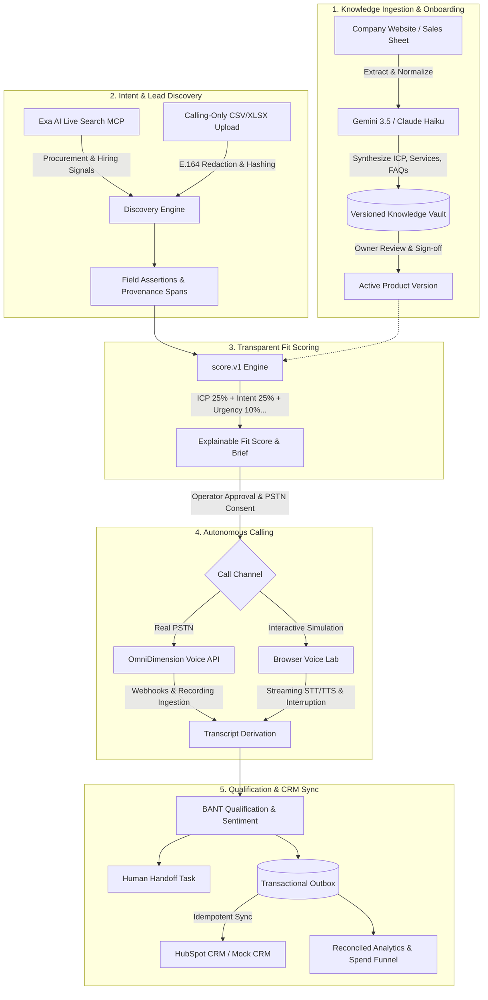

# 🎙️ Evidence-First AI Sales Agent (Autonomous SDR Platform)

[](https://www.python.org/)
[](https://nodejs.org/)
[](https://nextjs.org/)
[](https://fastapi.tiangolo.com/)
[](https://www.postgresql.org/)
[](https://opensource.org/licenses/MIT)

An enterprise-grade, **evidence-backed autonomous AI sales development representative (SDR)**. The platform turns verified public signals into qualified opportunities, enforces consent-gated multi-channel outbound voice calls, grounds every conversational claim in an immutable company knowledge base, and syncs structured outcomes directly to HubSpot CRM.

---

## 📑 Table of Contents

- [Core Principles & Value Proposition](#-core-principles--value-proposition)
- [System Architecture](#-system-architecture)
- [Key Features](#-key-features)
- [Technology Stack](#-technology-stack)
- [Quickstart & Local Setup](#-quickstart--local-setup)
- [Environment Configuration](#-environment-configuration)
- [Demo Walkthrough Journey](#-demo-walkthrough-journey)
- [Safety, Privacy & Guardrails](#-safety-privacy--guardrails)
- [Testing & Quality Assurance](#-testing--quality-assurance)
- [Repository Structure](#-repository-structure)
- [Documentation & Runbooks](#-documentation--runbooks)

---

## 🎯 Core Principles & Value Proposition

Traditional AI sales bots frequently hallucinate facts, guess prospect budgets, fabricate commitments, and run unconstrained spam cycles. This platform is built on an **evidence-first foundation**:

1. **Zero Hallucination & Exact Provenance**: Every lead qualification point, extracted need, and fit score links directly to a verifiable text span from an original public source (RFP, company website, job posting).
2. **Explicit Unknowns**: If budget, authority, or timeline is not stated in the source, the system honestly labels it as `Unknown` rather than fabricating estimates.
3. **Approved Knowledge Grounding**: Voice agents are strictly bounded by an owner-approved, versioned company knowledge base. Pricing or features outside the approved catalog automatically trigger a human handoff.
4. **Consent-Gated Calling**: Autonomous PSTN telephony requires explicit operator attestation, strict E.164 phone verification, a single consenting test number, and a real-time kill switch.
5. **Closed-Loop Execution**: Calls produce structured qualification summaries, objection matrices, human follow-up tasks, and idempotent transactional outbox syncs to HubSpot CRM.

---

## 🏗️ System Architecture



---

## ⚡ Key Features

### 1. Guided Business Onboarding & Knowledge Vault
- Ingest company URLs, sales collateral, or documents (`Futurrizon_Sales_Sheet.md`, PDF, DOCX, TXT, HTML).
- Automatically parses and organizes:
  - **Company Profile & Value Proposition**
  - **Ideal Customer Profile (ICP)**: Target industries, company size, and pain points.
  - **Core Offerings & Service Catalog**: Scopes, implementations, and delivery models.
  - **Objection Handling Matrix**: Pre-approved counter-arguments and answers.
  - **Approved FAQs & Guardrails**: Hard boundaries on pricing, commitments, and escalation rules.
- Creates an **immutable, versioned snapshot** upon owner approval.

### 2. Dual Lead Discovery Channels
- **Live Market Intent Discovery**: Integrates with Exa AI search to scan the public web for technology migrations, RFP notices, enterprise tenders, and active hiring expansions.
- **Calling-Only CSV/XLSX Bulk Ingestion**: Upload enterprise contact spreadsheets with automatic phone format validation (E.164), domain normalization, and SHA-256 phone hashing.
- **Clean Slate Reset**: Zero unwanted mock data on initialization; start fresh with your own live data or custom lead lists.

### 3. Explainable Lead Scoring (`score.v1`)
A fully auditable, multi-factor scoring formula that eliminates black-box AI decisions:
- **ICP Fit (25%)**: Company profile alignment against approved knowledge rules.
- **Explicit Commercial Intent (25%)**: Verifiable requirement statements.
- **Urgency (10%)**: Stated project deadlines or RFP cutoff dates.
- **Source Quality (10%)**: Domain authority and document authenticity.
- **Data Confidence (10%)**: Completeness of extracted assertions.
- **Engagement (10%)**: Historical response status.
- **Freshness (10%)**: Time-decay from publication/observation date.
- Every score links directly to highlighted source text spans.

### 4. Autonomous Voice Telephony (Dual Engine)
- **OmniDimension Real Outbound PSTN Calling**:
  - Dispatches live telephone calls to consenting numbers via the OmniDimension Voice API.
  - Automates call lifecycle: Dispatched → In-Progress → Completed.
  - Pulls call audio recordings, synchronizes full conversation transcripts, and extracts qualification criteria.
- **Interactive In-Browser Voice Lab**:
  - Full duplex real-time browser voice testing with microphone/speaker streaming.
  - Natural **barge-in interruption**: The agent stops speaking immediately when the prospect starts talking.
  - Powered by Gemini 3.5 Flash-Lite / Claude Haiku with deterministic fallback.
  - Dual-key seamless failover: If the primary LLM key is rate-limited, the system transparently falls back to `GEMINI_FALLBACK_API_KEY`.

### 5. Structured Qualification & CRM Synchronization
- Derives structured BANT outcomes (Need, Timeline, Decision Authority, Objections).
- Creates prioritized human handoff tasks with explicit action items.
- Reliable **transactional outbox pattern** for HubSpot CRM integration:
  - Updates contact records, attaches meeting notes, and creates follow-up tasks.
  - Fallback to local Mock CRM for completely offline or zero-credential development.

### 6. Observability & Unit Economics Dashboard
- Live conversion funnel: `Discovered → Reviewed → Approved → Called → Qualified → Handoff`.
- Real-time voice latency tracking, token usage, and telephony spend.
- Daily budget limits and rate-limiting safeguards.

---

## 🛠️ Technology Stack

| Layer | Technologies | Purpose |
|---|---|---|
| **Frontend** | Next.js 16 (App Router), React 19, TypeScript, Tailwind CSS, TanStack Query | Responsive, dark-mode accessible workspace |
| **Backend** | Python 3.12, FastAPI, SQLAlchemy 2, Pydantic v2, Alembic | High-throughput asynchronous REST & WebSocket API |
| **Database** | PostgreSQL 17 | 29 normalized tables, transactional outbox, tenant isolation |
| **AI Dialogue** | Google Gemini 3.5 Flash-Lite, Anthropic Claude 3.5 Haiku | Intent interpretation, structured extraction, voice dialogue |
| **Search & Discovery** | Exa AI Search (MCP & REST API) | Real-time commercial intent & hiring signal discovery |
| **Telephony** | OmniDimension API, Twilio ConversationRelay, Web Audio API | Live outbound PSTN calling and browser voice simulation |
| **CRM Integration** | HubSpot REST API v3 (2026-03), Mock CRM Adapter | Idempotent contact, note, and task synchronization |
| **Tooling & Test** | pytest, Playwright, Vitest, Ruff, mypy, uv, pnpm | Static typing, contract testing, and end-to-end verification |

---

## 🚀 Quickstart & Local Setup

### Prerequisites
- **Node.js 22 LTS** & `pnpm` (or `npm`)
- **Python 3.12** & [`uv`](https://github.com/astral-sh/uv)
- **PostgreSQL 17** running locally on port 5432

---

### Step 1: Clone and Configure Environment

```bash
git clone https://github.com/Bhavya302005/Ai-Sales-Agent.git
cd Ai-Sales-Agent
cp .env.example .env
```

Edit `.env` with your API keys (see [Environment Configuration](#-environment-configuration)).

---

### Step 2: Install Dependencies & Setup Database

#### Using Native Commands (Recommended)

```bash
# 1. Create Python virtual environment and install backend dependencies
uv venv .venv --python 3.12
source .venv/bin/activate
uv pip install -e packages/domain -e 'apps/api[dev]'

# 2. Install frontend dependencies
cd apps/web && npm install && cd ../..

# 3. Run database migrations
.venv/bin/alembic -c apps/api/alembic.ini upgrade head

# 4. Initialize / Reset demo state (clean baseline)
.venv/bin/python -m scripts.reset_demo --confirm-local-demo-reset
```

*(Alternatively, run `make native-install`, `make native-migrate`, and `make native-reset-demo` if `make` is installed).*

---

### Step 3: Run the Services

Start the backend and frontend in separate terminals:

**Terminal 1 — Backend API (Port 8000):**
```bash
.venv/bin/uvicorn app.main:app --app-dir apps/api --host 127.0.0.1 --port 8000 --reload
```

**Terminal 2 — In-Browser Voice Service (Port 8001):**
```bash
.venv/bin/uvicorn app.voice_main:app --app-dir apps/api --host 127.0.0.1 --port 8001 --reload
```

**Terminal 3 — Frontend Web App (Port 3000):**
```bash
cd apps/web
npm run dev
```

---

### Step 4: Access the Application

- **Web Dashboard**: [`http://localhost:3000`](http://localhost:3000)
- **Interactive Voice Lab**: [`http://localhost:3000/voice-lab`](http://localhost:3000/voice-lab)
- **FastAPI Interactive Docs**: [`http://localhost:8000/docs`](http://localhost:8000/docs)

---

## ⚙️ Environment Configuration

| Variable | Required | Default | Description |
|---|---|---|---|
| `DATABASE_URL` | **Yes** | `postgresql+psycopg://...` | PostgreSQL connection string. |
| `JWT_SECRET` | **Yes** | — | Minimum 32-character secret for signing auth tokens. |
| `GEMINI_API_KEY` | Recommended | — | Google Gemini API key for extraction & natural voice dialogue. |
| `GEMINI_FALLBACK_API_KEY` | Optional | — | Secondary Google project key for transparent failover. |
| `GEMINI_DIALOGUE_MODEL` | Optional | `gemini-3.5-flash-lite` | Model identifier for natural voice classification. |
| `ANTHROPIC_API_KEY` | Optional | — | Claude API key (when `DIALOGUE_MODE=anthropic`). |
| `OMNIDIM_API_KEY` | Optional | — | OmniDimension API key for real PSTN outbound calling. |
| `OMNIDIM_AGENT_ID` | Optional | — | Configured outbound agent ID in OmniDimension. |
| `OMNIDIM_TEST_TO_NUMBER` | Optional | — | Consenting test destination phone number (E.164 format). |
| `ENABLE_OUTBOUND_PSTN` | Optional | `false` | Master toggle to enable real telephone dispatch. |
| `EXA_API_KEY` | Optional | — | Exa AI Search API key for live web discovery. |
| `HUBSPOT_ACCESS_TOKEN` | Optional | — | Scoped private app token for HubSpot CRM integration. |
| `CRM_MODE` | Optional | `mock` | CRM sync mode (`mock` or `hubspot`). |
| `VOICE_TRANSPORT` | Optional | `browser` | Active voice transport (`browser`, `omnidim`, or `twilio`). |
| `DAILY_SPEND_LIMIT_INR` | Optional | `500` | Hard stop limit on telephony and AI provider spend. |
| `CALLS_KILL_SWITCH` | Optional | `false` | Emergency kill switch to immediately halt all active calling. |

---

## 🎬 Demo Walkthrough Journey

The application is structured around a streamlined 7-step pipeline:

1. **🏢 Onboarding & Knowledge Base (`/onboarding`)**:
   - Provide a company URL or upload a pitch deck / sales sheet (`Futurrizon_Sales_Sheet.md`).
   - Review the auto-extracted ICP, value propositions, offerings, and objection-handling rules.
   - Click **Approve Profile** to create the active, immutable knowledge version.

2. **🔍 Sources & Lead Discovery (`/sources`)**:
   - Trigger an **Exa AI live discovery** run or ingest a lead list (`demo_leads.csv`).
   - Review verified evidence excerpts and source URLs.

3. **📊 Leads Pipeline & Scoring (`/leads`)**:
   - Inspect the **score.v1 breakdown** (ICP fit, intent, urgency, confidence).
   - View exact highlighted source text spans for every lead assertion.
   - Click **Approve Lead** to promote the lead into call eligibility.

4. **📞 Campaigns & Dispatch (`/campaigns`)**:
   - Create an outbound campaign.
   - Provide explicit operator consent attestation for PSTN calling.
   - Dispatch an outbound call via **OmniDimension** or launch the **Browser Voice Lab**.

5. **🎙️ Voice Qualification**:
   - Engage with the AI sales agent in English or Hindi.
   - Test natural interruptions (barge-in) and ask out-of-scope questions to observe guardrailed fallback.

6. **📝 Qualification & Handoff (`/calls/:id`)**:
   - Review the generated call summary, verbatim transcript, and qualification criteria.
   - Inspect the auto-generated follow-up task.

7. **📈 Analytics & CRM Sync (`/analytics`)**:
   - Verify that the call note and task were synced to HubSpot (or Mock CRM).
   - Inspect unit economics, call duration, voice latency, and conversion funnel metrics.

---

## 🔒 Safety, Privacy & Guardrails

- **Tenant Isolation**: Every database query is tenant-scoped via authenticated membership (`tenant_id`). Cross-tenant access is architecturally prevented.
- **PII & Phone Redaction**: Phone numbers are stored as SHA-256 hashes with E.164 redaction. Full raw phone numbers are never returned in client APIs or persisted in application logs.
- **Prompt Injection Defense**: External web pages and uploaded documents are treated as untrusted data. Their text is normalized and never allowed to execute tool instructions or override agent policy.
- **Strict Compliance & Consent**: Outbound PSTN calling requires an operator attestation valid for 24 hours, restricted to pre-consenting test recipients.
- **Emergency Kill Switch**: Setting `CALLS_KILL_SWITCH=true` halts all outbound queues and active dispatches immediately.

---

## 🧪 Testing & Quality Assurance

Run the comprehensive test suite across the monorepo:

```bash
# 1. Backend unit and contract tests (100+ tests)
.venv/bin/pytest apps/api/tests

# 2. Python linting and static type checks
.venv/bin/ruff check apps/api database scripts
cd apps/api && ../../.venv/bin/mypy app && cd ../..

# 3. Web frontend typecheck, lint, and unit tests
cd apps/web
npm run typecheck
npm run lint
npm run test
cd ../..

# 4. Security secrets audit (verifies no credentials in source)
.venv/bin/python scripts/check_secrets.py
```

---

## 📁 Repository Structure

```text
Ai_Sales_Agent/
├── apps/
│   ├── api/                 # FastAPI REST and WebSocket API
│   │   ├── app/             # Application controllers, routers & domain logic
│   │   │   ├── calling/     # Call orchestration, eligibility & consent engine
│   │   │   ├── discovery/   # Exa AI connector & web ingestion
│   │   │   ├── outcomes/    # Transcript analysis & qualification extraction
│   │   │   └── persistence/ # SQLAlchemy ORM models & database schemas
│   │   └── tests/           # Comprehensive backend test suite
│   └── web/                 # Next.js 16 frontend workspace UI
│       ├── app/             # Next.js App Router pages (onboarding, leads, voice-lab, analytics)
│       └── components/      # Accessible UI components & design system
├── database/
│   ├── migrations/          # Alembic database migration scripts
│   └── seeds/               # Idempotent demo database seeders
├── docs/
│   ├── demo/                # Acceptance criteria, runbooks, and OmniDimension setup
│   └── implementation/      # Task board and architectural decision records (ADRs)
├── packages/
│   └── domain/              # Shared domain models and strict contracts
├── scripts/                 # Demo reset, secret scanner, and maintenance scripts
├── CODEX_4_DAY_AI_SALES_AGENT_MVP_PLAN.md  # Product specification & contract
├── Makefile                 # Convenient local development targets
└── README.md                # Project documentation
```

---

## 📚 Documentation & Runbooks

- **[Product Contract](./CODEX_4_DAY_AI_SALES_AGENT_MVP_PLAN.md)**: Full architecture specification and MVP boundary definitions.
- **[Release & Demo Runbook](./docs/demo/ONE_DAY_RELEASE_RUNBOOK.md)**: Clean start, demo script, and reset commands.
- **[OmniDimension Telephony Setup](./docs/demo/OMNIDIM_SETUP.md)**: Step-by-step guide for outbound PSTN telephony setup.
- **[Requirement & Acceptance Matrix](./docs/demo/REQUIREMENT_COVERAGE.md)**: Detailed audit of criteria and verification tests.
- **[Task Board](./docs/implementation/TASK_BOARD.md)**: Live task status tracking.

---

<div align="center">
  <sub>Built with precision for enterprise sales teams. Zero hallucinations. Verifiable evidence. Complete peace of mind.</sub>
</div>
