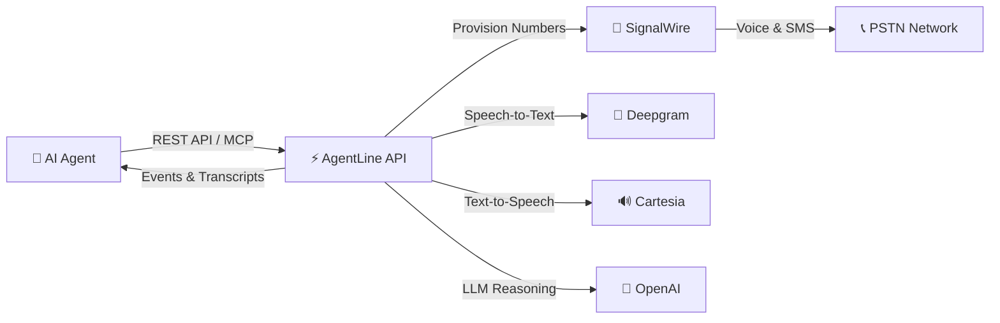

<div align="center">
  
  <h1>AgentLine — Phone API for AI Voice Agents</h1>
  <p><strong>Open-source AI phone agent platform — real phone numbers, outbound & inbound voice calls, SMS, MCP, and IVR</strong></p>
  <p>Give Claude, Cursor, OpenClaw, Hermes, or any LLM a real phone number. Make and receive PSTN calls, navigate phone menus, and read transcripts — one FastAPI, no telecom expertise.</p>

  <br/>

  [](LICENSE)
  [](https://python.org)
  [](https://fastapi.tiangolo.com)
  [](https://modelcontextprotocol.io)
  [](Dockerfile)
  [](https://discord.gg/69SVE2jWNr)

  <br/>

  [Website](https://agentline.cloud) · [Docs](https://agentline.cloud/docs) · [Skill File](https://agentline.cloud/skill.md) · [Discord](https://discord.gg/69SVE2jWNr)

  <br/>
</div>

---

## What is AgentLine?

AgentLine is an **open-source AI phone agent** / **voice agent telephony API**. It gives coding agents and LLM apps a real US phone number, a voice pipeline (STT + LLM + TTS), and the ability to place **outbound calls**, answer **inbound calls**, handle **SMS**, and walk **IVR / DTMF** menus — over REST or MCP.

Use it as a self-hosted alternative to stitching Twilio Programmable Voice + Deepgram + a voice LLM yourself, or as an open-source counterpart to hosted voice-agent products (Vapi, Retell, Bland).

```
Your AI Agent (Claude, Cursor, OpenClaw, Hermes, Codex)
        →  AgentLine REST / MCP
        →  Real PSTN phone calls, SMS, transcripts
```

Works with **Claude Code**, **Claude Desktop**, **Cursor**, **OpenClaw**, **Hermes**, **Codex**, and any MCP or HTTP client.

### Why AgentLine?

| | AgentLine | Twilio / Vonage | Vapi / Retell |
|---|---|---|---|
| **Built for AI agents** | ✅ Phone number + voice pipeline | ❌ Call-center APIs, BYO AI | ✅ Hosted voice agents |
| **MCP + skill file** | ✅ Native | ❌ None | ❌ Rare |
| **Self-host / MIT** | ✅ Your keys, your data | ❌ Proprietary | ❌ Proprietary SaaS |
| **Setup** | Minutes | Hours of stitching | Minutes, vendor lock-in |
| **Outbound + inbound + SMS** | ✅ | ✅ | Varies |

### Use cases

- **AI receptionist** — answer inbound calls with a custom greeting and system prompt
- **Outbound voice agent** — reminders, follow-ups, feedback, and business inquiries
- **MCP telephony** — “call this number” from Claude Code, Cursor, or OpenClaw
- **IVR navigation** — press real DTMF keys on phone menus and leave voicemail
- **Owner task line** — call your agent from a registered number and give it work to run after hangup

---

## Features

- 📞 **Voice Calls** — Make and receive real phone calls through a simple API
- 🎙️ **AI Voice Pipeline** — Built-in STT (Deepgram) + LLM (GPT-4o) + TTS (Cartesia) pipeline
- 🎛️ **DTMF / IVR** — Real touch-tone audio so outbound agents can navigate phone menus and leave voicemail
- ⚡ **Semantic turn-taking** — Adaptive end-of-turn detection with fast barge-in instead of a fixed pause
- 👤 **Owner task mode** — Calls from a registered owner number capture instructions for later execution
- 💬 **SMS** — Receive and read inbound text messages
- 🔌 **MCP Server** — Native Model Context Protocol tools for Claude Desktop, Claude Code, Cursor, OpenClaw, and Codex
- 📋 **Skill File** — One-file install for Claude Code, Cursor, OpenClaw, Hermes, and similar runtimes
- 🌍 **PSTN via SignalWire** — US numbers, Twilio-compatible LaML, pluggable provider architecture
- 📝 **Transcripts** — Automatic call transcription with full conversation history
- 🔄 **Persistent Agent Relay** — outbound WebSocket with reconnect, ACK/replay, turn-safe context, and runtime-aware setup
- 🪝 **Per-agent webhooks** — Signed JSON POSTs as a fallback when a relay cannot run
- 📬 **Event Mailbox** — durable fallback for agents without a relay or webhook
- 💰 **Built-in Billing** — Per-second call billing with balance tracking
- 🐳 **Docker Ready** — One command to run the entire stack locally

---

## Architecture



### Voice Pipeline

Live calls stream audio over SignalWire `<Connect><Stream>`:

```
Caller audio → Deepgram STT → semantic turn-taking
  → hosted LLM (or live relay context) → Cartesia TTS → caller
```

- **Semantic turn-taking** waits longer when the caller is mid-thought and answers immediately on a complete question.
- **Barge-in** flushes playback as soon as the caller starts speaking.
- **DTMF** turns `[DTMF:1]` markers into real touch-tone audio for IVR menus.
- **Relay mode** (optional) pushes each caller turn to a local agent over an outbound WebSocket and speaks the returned context verbatim.

---

## Quick Start

### Option 1: Docker Compose (Recommended)

```bash
git clone https://github.com/agentlineHQ/AgentLine.git
cd AgentLine
cp .env.example .env
# Fill in your API keys in .env (see Configuration below)
docker-compose up -d
```

This starts:
- **API server** at `http://localhost:8000`
- **PostgreSQL** at `localhost:5432` (schema auto-applied)
- **Redis** at `localhost:6379`

### Option 2: Local Development

```bash
git clone https://github.com/agentlineHQ/AgentLine.git
cd AgentLine
python -m venv venv
source venv/bin/activate  # or venv\Scripts\activate on Windows
pip install -r requirements.txt
cp .env.example .env
# Fill in your API keys
uvicorn agentline.main:app --reload
```

### Option 3: Use the Hosted Version

Skip self-hosting — sign up at [agentline.cloud](https://agentline.cloud) and get an API key instantly.

---

## Configuration

Copy `.env.example` to `.env` and fill in your credentials:

| Variable | Required | Description |
|----------|----------|-------------|
| `SUPABASE_URL` | Yes | Your Supabase project URL |
| `SUPABASE_ANON_KEY` | Yes | Supabase anonymous key |
| `SUPABASE_SERVICE_ROLE_KEY` | Yes | Supabase service role key (server-side) |
| `DATABASE_URL` | Yes | PostgreSQL connection string |
| `SIGNALWIRE_PROJECT_ID` | Yes | SignalWire project ID |
| `SIGNALWIRE_TOKEN` | Yes | SignalWire API token |
| `SIGNALWIRE_SPACE_URL` | Yes | Your SignalWire space URL |
| `DEEPGRAM_API_KEY` | Yes | Deepgram API key (STT) |
| `CARTESIA_API_KEY` | Yes | Cartesia API key (TTS) |
| `OPENAI_API_KEY` | Yes | OpenAI API key (LLM) |
| `TURN_TAKING_MODEL` | No | Fast OpenAI-compatible model for end-of-turn detection (defaults to `gpt-4o-mini`) |
| `REDIS_URL` | No | Redis URL (defaults to `localhost:6379`) |
| `SECRET_KEY` | Yes | App secret key |
| `BASE_URL` | Yes | Public URL of your deployment |

---

## API Reference

Once running, visit `http://localhost:8000/docs` for the interactive Swagger UI.

### Core Endpoints

| Method | Path | Description |
|--------|------|-------------|
| `POST` | `/v1/agents` | Create a new AI voice agent |
| `GET` | `/v1/agents` | List all agents |
| `PATCH` | `/v1/agents/{id}` | Update agent (prompt, voice, greeting) |
| `POST` | `/v1/numbers` | Provision a phone number |
| `GET` | `/v1/numbers` | List phone numbers |
| `POST` | `/v1/calls` | Make an outbound call |
| `GET` | `/v1/calls` | List calls |
| `GET` | `/v1/calls/{id}/transcript` | Get call transcript |
| `POST` | `/v1/calls/{id}/hangup` | End an active call |
| `POST` | `/v1/calls/{id}/context` | Push live relay context for a caller turn |
| `GET` | `/.well-known/agentline.json` | Discover relay, webhook, and runtime setup |
| `GET` | `/v1/events` | Poll event mailbox (fallback) |
| `WS` | `/v1/events/ws` | Persistent outbound agent relay |
| `GET` | `/v1/events/peek` | Peek at events (non-destructive) |
| `GET/POST/DELETE` | `/v1/webhooks` | Configure a per-agent signed webhook |
| `GET` | `/v1/messages` | List SMS messages |
| `GET` | `/v1/billing/balance` | Check account balance |
| `GET` | `/v1/billing/expenditure` | Spending breakdown |

### Authentication

All requests require an API key (`al_live_...`; legacy `sk_live_...` keys are still accepted):

```bash
curl -H "Authorization: Bearer al_live_YOUR_KEY" \
     -H "Content-Type: application/json" \
     https://api.agentline.cloud/v1/agents
```

---

## MCP Server Integration

AgentLine includes a built-in **MCP (Model Context Protocol) server**, so AI agents like Claude Desktop and Cursor can use telephony tools natively.

### Connect from Claude Desktop

Add to your Claude Desktop config:

**Windows:** `%APPDATA%\Claude\claude_desktop_config.json`
**macOS:** `~/Library/Application Support/Claude/claude_desktop_config.json`

```json
{
  "mcpServers": {
    "agentline": {
      "command": "npx",
      "args": [
        "-y", "mcp-remote@latest",
        "http://localhost:8000/mcp",
        "--header", "Authorization: Bearer al_live_YOUR_KEY"
      ]
    }
  }
}
```

### Available MCP Tools

| Tool | Description |
|------|-------------|
| `create_agent` | Create a new AI voice agent |
| `list_agents` | List all agents |
| `update_agent` | Update agent config/prompt/voice |
| `make_outbound_call` | Initiate an outbound phone call |
| `list_calls` | List call history |
| `get_call_transcript` | Get the full transcript of a call |
| `hangup_call` | End an active call |
| `push_call_context` | Push live relay context for a caller turn |
| `set_webhook` | Create or replace a per-agent webhook |
| `buy_phone_number` | Provision a new phone number |
| `list_phone_numbers` | List all phone numbers |
| `poll_events` | Poll event mailbox |
| `peek_events` | Peek at pending events |
| `get_account_balance` | Check account balance |
| `list_available_voices` | List voice presets |

### Test with MCP Inspector

```bash
npx @modelcontextprotocol/inspector http://localhost:8000/mcp
```

---

## Skill File — Install in 30 Seconds

AgentLine ships with a **skill file** that lets any AI agent gain telephony powers instantly:

```
https://agentline.cloud/skill.md
```

**How to use:**
1. Copy the skill URL above
2. Add it to your AI agent (Claude Code, Cursor, OpenClaw, etc.)
3. Set your `AGENTLINE_API_KEY` environment variable
4. Tell your agent: *"Call +1234567890"* — it just works!

The skill file is also included in this repo at [`skills/agentline/SKILL.md`](skills/agentline/SKILL.md).

---

## Tech Stack

| Component | Technology |
|-----------|-----------|
| **API Framework** | [FastAPI](https://fastapi.tiangolo.com) (async Python) |
| **Database** | PostgreSQL ([Supabase](https://supabase.com)) |
| **Cache** | Redis |
| **Phone Numbers & Calls** | [SignalWire](https://signalwire.com) |
| **Speech-to-Text** | [Deepgram](https://deepgram.com) Nova-2 |
| **Text-to-Speech** | [Cartesia](https://cartesia.ai) Sonic |
| **LLM** | [OpenAI](https://openai.com) GPT-4o / GPT-4o-mini |
| **MCP Server** | [FastAPI-MCP](https://github.com/tadata-org/fastapi-mcp) |
| **Deployment** | Docker, [Railway](https://railway.app) |

---

## Deployment

### Docker

```bash
docker build -t agentline .
docker run -p 8000:8000 --env-file .env agentline
```

### Any Cloud Provider

AgentLine runs anywhere that supports Python 3.12+ and Docker: AWS, GCP, Azure, Fly.io, Render, Railway, etc.

---

## Database Schema

The database schema is in [`schema.sql`](schema.sql). It creates tables for:

- **accounts** — User accounts with balance tracking
- **api_keys** — Hashed API keys for authentication
- **agents** — AI voice agent configurations
- **phone_numbers** — Provisioned phone numbers
- **calls** — Call records with transcripts
- **messages** — SMS message records
- **event_mailbox** — Server-side event queue
- **billing_ledger** — Immutable billing transaction log

Migrations are in the [`migrations/`](migrations/) directory.

---

## Pricing (Hosted Version)

If using the hosted version at [agentline.cloud](https://agentline.cloud):

| Item | Cost |
|------|------|
| Voice calls (inbound/outbound) | $0.10/min (billed per second) |
| Phone number | $2.00 (one-time) |
| SMS (inbound) | Free |

Self-hosted: you pay only your provider costs (SignalWire, Deepgram, Cartesia, OpenAI).

---

## Contributing

We welcome contributions! See [CONTRIBUTING.md](CONTRIBUTING.md) for guidelines.

- 🐛 **Bug reports** — [Open an issue](https://github.com/agentlineHQ/AgentLine/issues/new?template=bug_report.md)
- 💡 **Feature requests** — [Open an issue](https://github.com/agentlineHQ/AgentLine/issues/new?template=feature_request.md)
- 🔧 **Pull requests** — Fork, branch, PR

---

## Community

- 💬 [Discord](https://discord.gg/69SVE2jWNr) — Chat with the team and other builders
- 🐦 [Twitter](https://twitter.com/ovalpod94416) — Updates and announcements
- 📖 [Docs](https://agentline.cloud/docs) — Full API documentation
- 📝 [Blog](https://agentline.cloud/blogs) — Guides and tutorials

---

## License

[MIT](LICENSE) — use it for anything. Commercial use welcome.

---

<div align="center">
  <p>Built with ❤️ by the <a href="https://agentline.cloud">AgentLine</a> team</p>
  <p><sub>Give your AI agent a voice. ☎️</sub></p>
</div>
